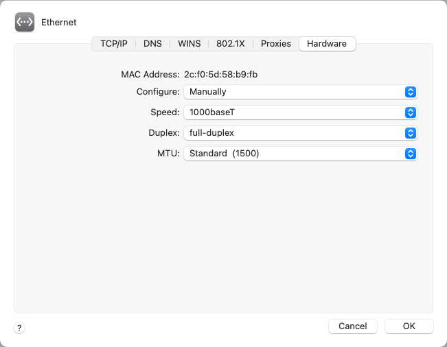
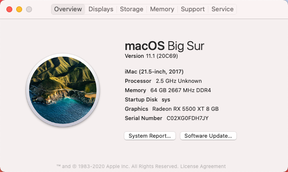

# Hackintosh-10900ES-MSI-MAGB460MMortar
i9-10900ES + MSI MAG B460M Mortar + AMD Radeon RX 5500 XT + Hackintosh Big Sur + OpenCore 0.6.3

# Info PC

> Main: MSI MAG B460M Mortar
>
> CPU: i9-10900ES(QTB1)
>
> Ram: 64GB (4x16GB - 2666) CUSO 
>
> VGA: ASROCK Radeon RX 5500 XT
>
> SSD: Gloway VAL 480GB

# OpenCore(0.6.3)

- https://dortania.github.io/OpenCore-Desktop-Guide

# Note

__*If your network does not support 2.5G, you do need to manually configure your ethernet.*__

Example:

# Result

